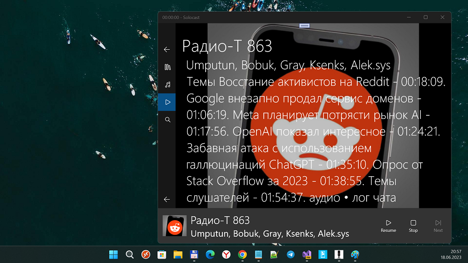

## Solocast 1.1.1

- UWP
- Min. Win. OS Build -> 14393 
- Targets: x64; ARM

## About the original Podcasts-WindowsUniversal
The long await rewrite of the Windows Podcasts App.

## Screenshots

## Overview
This application will be an entire rewrite of the exists Podcasts App in Windows 8.1. It will have most of the features that that one has, but it will be built for the Windows Universal Platform.

## My use case (user story/ scenario of using)
1. I go to Search mode, do some new podcast search, the copy feed_url to clipboard :)
2. I switch to Podcasts page, click "+" (add podcast), and paste url. 
3. Ready to listen somthing new !

## Features
These features will be ticked off as I implement them in the app:
* [ ] Search for podcasts (audio and video)
* [X] Subscribe to podcasts
* [ ] Favorite podcasts
* [ ] Shared podcasts and episodes
* [ ] Secondary tiles with podcasts episodes
* [ ] Notifications with newly available episodes (**feature not available in current Podcasts version**)
* [ ] Set number of episodes to keep from each podcast (individually and globaly)

## References
- https://github.com/Solocast/solocast-clients/ Original Solocast UWP app
- https://github.com/robertiagar Robert Iagar, Solocast creator/developer
- https://www.robertiagar.com/2015/07/08/recreating-the-windows-phone-podcasts-app-as-an-universal-windows-app-part-i/ Recreating the Windows Phone Podcasts app as an Universal Windows App (Part I; 2015 year) 

## ..
As is. No support. RnD only.

## .
[m][e] 2023

